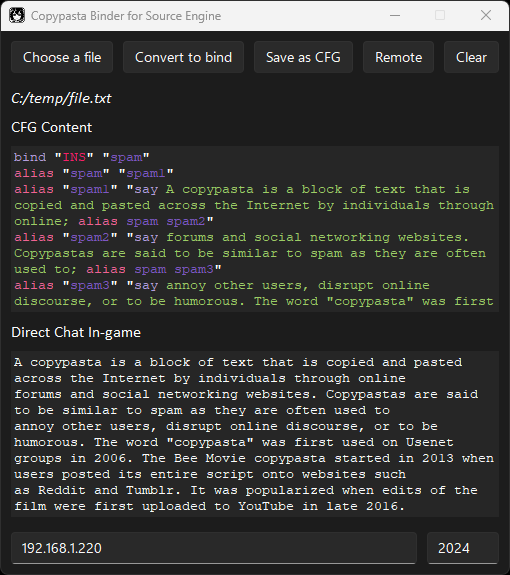

# Copypasta Binder for Source Engine

<p align="center">

</p>

CBSE is a utility tool designed for Source Engine games. It allows players to easily convert text files into `.cfg` files that can spam the game chat, facilitating in-game communication by increasing morale via copypastas.

<b>NOTE!</b> <i>There is no scientific evidence for this, so results may vary depending on the mood of your fellow players.</i>

# Installation

Activate a virtual environment, install the dependencies, and run the `python main.py` command to run the program. Alternatively, download and run the executable from the Releases tab.

1. Clone the repository (Optional):

   ```
   git clone https://github.com/Oscar-97/Copypasta-Binder-for-Source-Engine.git
   cd Copypasta-Binder-for-Source-Engine
   ```

2. Set up a Virtual Environment:

   ```
   python -m venv venv
   venv\Scripts\activate
   ```

3. Install Dependencies:

   ```
   pip install -r requirements.txt
   ```

# Usage

## 1. Start the program

- Run the program using Python:

  ```
  python main.py
  ```

- Or download the executable from the releases tab and run it.

## 2. Using the GUI

- Click on the `Choose a file` button.
- Select a text file and press the `Convert to bind` button.
- Click the `Save as CFG` button.
- Enter a name and save the `.cfg` file to, for example, `...\Steam\steamapps\common\Counter-Strike Global Offensive\game\csgo\cfg`.
- Manually change the bound button or other settings by opening the `.cfg` file.

## 3. In-Game Usage:

- Press the "INSERT" button to start spamming line by line.
- ~~Alternatively, set -netconport `<number>` in the startup options along with host and port in the application to automatically spam in-game. Click the Remote button to start the process.~~ Not available in CS2 yet :(

# Customization

Modify the `split_text` function in `cbse_functions.py` to adjust the maximum number of characters and the word length to your needs.

# Building from source

To build the project with PyInstaller, a specification file is provided.

```
pyinstaller CBSE.spec
```

# Contributions

Feel free to submit pull requests, open issues, or suggest features.

# Why would you need a GUI for this?

Would it have been sufficient to have no GUI at all? Sure. This was created mainly to tinker with tkinter and explore its features, while using the [Sun Valley ttk theme](https://github.com/rdbende/Sun-Valley-ttk-theme).
